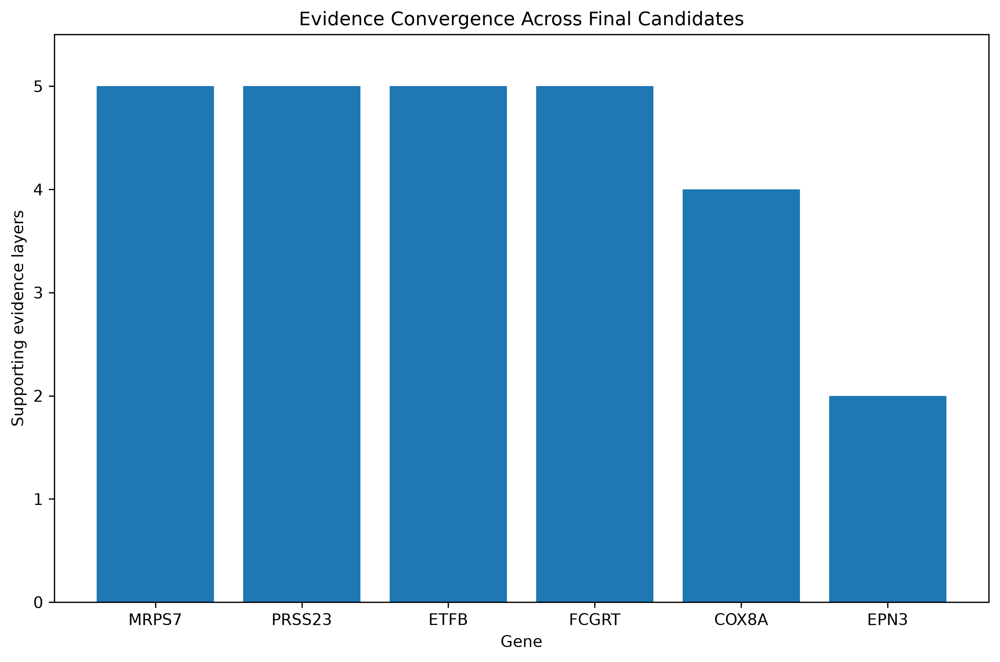
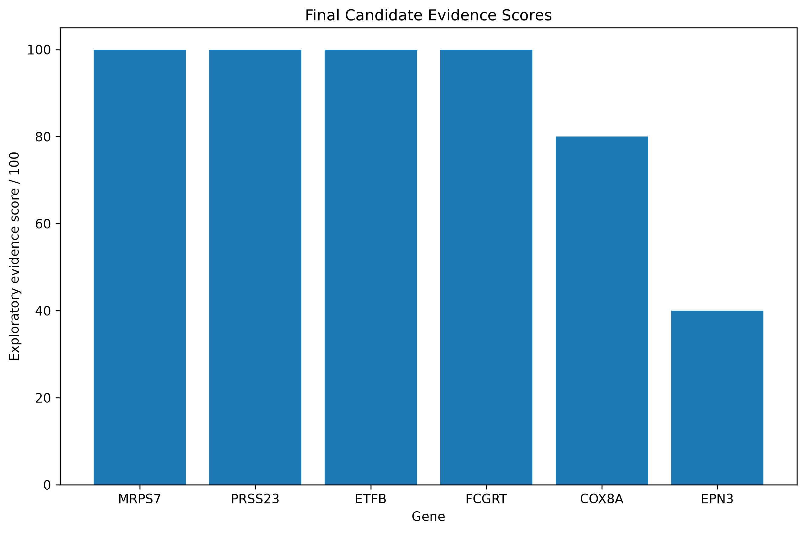
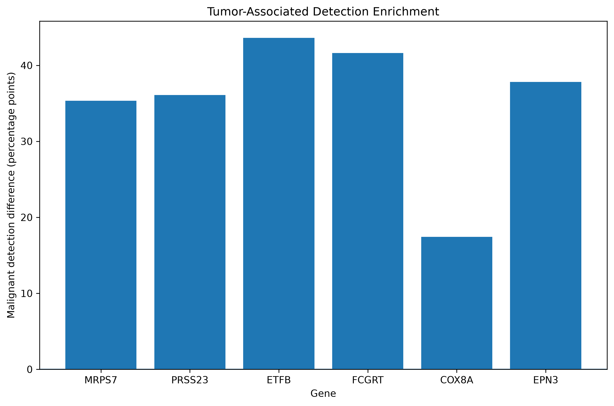
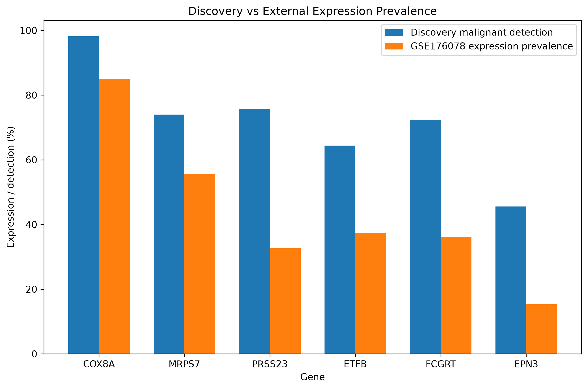

# Single-Cell RNA-seq and Machine Learning for Breast Cancer Biomarker Discovery and Validation

<p align="center">

**A sample-aware computational workflow integrating single-cell RNA-seq bioinformatics, machine learning, external validation, and tumor-specificity analysis for breast cancer biomarker candidate prioritization**

</p>

---

## Overview

Breast cancer is a highly heterogeneous disease in which malignant and non-malignant cell populations can coexist within the same tumor microenvironment.

Single-cell RNA sequencing (scRNA-seq) provides an opportunity to study this heterogeneity at cellular resolution and identify genes associated with malignant cell populations.

In this project, I developed a **sample-aware single-cell RNA-seq and machine-learning workflow** to prioritize breast cancer biomarker candidates.

The workflow integrates:

- Single-cell RNA-seq analysis
- Cell-level biological characterization
- CNV-supported malignant-cell identification
- Bioinformatics candidate prioritization
- Expression-based feature filtering
- Machine-learning feature selection
- Logistic regression
- Leave-One-Sample-Out (LOPO) validation
- ML feature recurrence and consensus analysis
- Discovery-dataset expression validation
- External validation using GSE176078
- Tumor/cell-type specificity analysis
- Multi-layer evidence integration

The analysis progressively reduced the candidate search space:

```text
36,626 genes
      ↓
13,732 expression-filtered genes
      ↓
986 bioinformatics candidates
      ↓
50 final bioinformatics candidates
      ↓
6 consensus candidates
```

### Final Consensus Candidates

**COX8A, EPN3, ETFB, FCGRT, MRPS7 and PRSS23**

Among these, **PRSS23, FCGRT, ETFB and MRPS7** showed the strongest tumor-associated expression evidence in the discovery analysis.

> **Important:** These genes are computationally prioritized research candidates and should not be interpreted as clinically validated biomarkers.

---

# Research Question

Can single-cell RNA-seq bioinformatics combined with machine learning identify breast cancer gene candidates that show reproducible association with malignant cells across independent samples?

The project was designed to evaluate candidates using multiple evidence layers rather than relying on a single statistical or machine-learning result.

```text
Bioinformatics evidence
        +
Machine-learning recurrence
        +
Discovery expression validation
        +
External validation
        +
Tumor specificity
        ↓
Final candidate prioritization
```

---

# Objectives

## Primary Objective

To develop a sample-aware computational framework for breast cancer biomarker candidate prioritization using single-cell RNA-seq and machine learning.

## Specific Objectives

1. Characterize breast cancer single-cell RNA-seq data.
2. Identify malignant-cell candidates using CNV-supported evidence.
3. Prioritize biologically relevant genes using bioinformatics analysis.
4. Perform expression-based feature filtering.
5. Construct machine-learning feature sets.
6. Apply logistic regression for malignant-cell classification.
7. Evaluate cross-sample generalization using Leave-One-Sample-Out validation.
8. Identify recurrent ML-selected genes.
9. Integrate machine-learning and bioinformatics evidence.
10. Validate consensus candidates at the expression level.
11. Perform external validation using GSE176078.
12. Evaluate tumor/cell-type specificity.
13. Integrate multiple evidence layers into a final candidate panel.
14. Interpret the candidates while explicitly documenting limitations.

---

# Dataset

## Discovery Dataset

The primary discovery dataset used in this project was:

**GSE228499**

The processed single-cell object contained:

| Property | Value |
|---|---:|
| Cells | 24,575 |
| Genes | 36,626 |
| Samples | 9 |
| Assay | RNA |
| Seurat | 5.5.1 |
| Assay class | Assay5 |

Samples:

```text
BC03
BC05
BC06
BC08
BC11
BC12
BC14
BC15
BC17
```

## External Validation Dataset

An independent dataset was used for external validation:

**GSE176078**

External validation was treated as an independent evidence layer rather than proof of clinical biomarker validity.

---

# Malignant Cell Identification

Malignant-cell candidates were identified using integrated biological annotation and CNV-supported evidence.

The original processed object contained:

```text
24,575 cells
36,626 genes
```

The machine-learning analysis subsequently focused on cells with defined ML labels.

The final ML dataset contained:

| ML Class | Cells |
|---|---:|
| Malignant | 1,017 |
| Diploid/non-malignant | 2,362 |
| **Total** | **3,379** |

---

# Informative Samples

Only three samples contained malignant cells in the final ML dataset:

| Sample | Malignant | Diploid/non-malignant | Total |
|---|---:|---:|---:|
| BC11 | 278 | 183 | 461 |
| BC12 | 380 | 32 | 412 |
| BC17 | 359 | 2 | 361 |

Therefore, the primary informative malignant-containing samples were:

```text
BC11
BC12
BC17
```

> **Limitation:** The limited number of malignant-containing samples is an important limitation of the study.

---

# Overall Workflow

```text
GSE228499
    ↓
Single-cell RNA-seq processing
    ↓
Cell annotation
    ↓
CNV-supported malignant-cell identification
    ↓
Bioinformatics candidate prioritization
    ↓
Expression filtering
    ↓
13,732 genes
    ↓
986 bioinformatics candidates
    ↓
50 final bioinformatics candidates
    ↓
Machine-learning analysis
    ↓
Logistic regression
    ↓
Leave-One-Sample-Out validation
    ↓
Data-driven feature selection
    ↓
ML feature recurrence
    ↓
Bioinformatics + ML consensus
    ↓
6 strong consensus candidates
    ↓
Discovery expression validation
    ↓
External validation using GSE176078
    ↓
Cell-type / tumor-specificity analysis
    ↓
Multi-layer evidence integration
    ↓
Final biological interpretation
```

---

# Bioinformatics Candidate Prioritization

Before machine learning, genes were prioritized through the bioinformatics pipeline.

The analysis incorporated evidence including:

- Malignant-cell characterization
- Differential expression
- Expression prevalence
- Sample-level consistency
- Biological annotation
- Epithelial/tumor-associated evidence
- Mitochondrial/OXPHOS characterization
- External validation
- Biological review

The bioinformatics pipeline produced:

```text
986 bioinformatics candidates
```

These were subsequently narrowed to:

```text
50 final bioinformatics candidates
```

The machine-learning analysis was therefore used as an **additional independent computational evidence layer**, rather than replacing the bioinformatics candidate-discovery pipeline.

---

# Expression Feature Filtering

Expression-based feature filtering was performed before machine learning.

| Stage | Genes |
|---|---:|
| Original genes | 36,626 |
| Expression-filtered genes | 13,732 |
| Removed | 22,894 |

Filtering criteria:

```text
Detection threshold: 1.0%
Minimum detected cells: 34
```

Final expression feature space:

```text
13,732 genes × 3,379 cells
```

---

# Machine-Learning Feature Sets

Three major feature sets were constructed:

| Feature Set | Number of Genes |
|---|---:|
| A - All expression-filtered genes | 13,732 |
| B - Bioinformatics candidates | 986 |
| C - Final bioinformatics candidates | 50 |

All 986 bioinformatics candidates were present after expression filtering.

All 50 final candidates were also present after expression filtering.

---

# Machine-Learning Strategy

The primary machine-learning algorithm used in this project was:

**Logistic Regression**

The purpose of the ML analysis was not simply to maximize predictive accuracy.

Instead, the analysis was used to investigate:

- Cross-sample classification behavior
- Feature robustness
- Recurrent feature selection
- Agreement between ML and bioinformatics evidence
- Candidate prioritization across independent evidence layers

---

# Leave-One-Sample-Out (LOPO) Validation

Randomly splitting individual cells can produce overly optimistic performance estimates because cells originating from the same biological sample are not fully independent.

Therefore, the project used **Leave-One-Sample-Out (LOPO)** validation.

The primary informative-sample strategy was:

```text
Test: BC11
Train malignant-containing samples: BC12 + BC17

Test: BC12
Train malignant-containing samples: BC11 + BC17

Test: BC17
Train malignant-containing samples: BC11 + BC12
```

In later data-driven feature-selection analysis, the training set also included available non-malignant samples while the held-out malignant-containing patient remained completely excluded from training.

The central question was:

> Can a model trained without a particular patient/sample generalize to cells from that held-out biological sample?

This provides a more realistic evaluation of cross-sample generalization than a simple random cell-level split.

---

# 50-Gene Logistic Regression

The initial model used the 50 final bioinformatics candidates.

## BC11

```text
ROC-AUC:    0.7448
PR-AUC:     0.7426
Accuracy:   0.6377
Precision:  0.7789
Recall:     0.5576
Specificity: 0.7596
F1:         0.6499
```

## BC12

```text
ROC-AUC:    0.7895
PR-AUC:     0.9627
Accuracy:   0.1335
Precision:  0.9600
Recall:     0.0632
Specificity: 0.9688
F1:         0.1185
```

## BC17

```text
ROC-AUC:    0.9387
PR-AUC:     0.9996
Accuracy:   0.2050
Precision:  1.0000
Recall:     0.2006
Specificity: 1.0000
F1:         0.3341
```

## Mean LOPO Performance

| Metric | Mean | SD |
|---|---:|---:|
| ROC-AUC | 0.824 | 0.102 |
| PR-AUC | 0.902 | 0.139 |
| Accuracy | 0.325 | 0.273 |
| Precision | 0.913 | 0.118 |
| Recall | 0.274 | 0.255 |
| Specificity | 0.909 | 0.131 |
| F1 | 0.368 | 0.267 |

The model showed useful ranking performance but relatively poor recall in BC12 and BC17.

Therefore, the 50-gene model was **not interpreted as a clinically useful classifier**.

Instead, its results were used as part of the broader exploratory ML analysis.

---

# 986-Gene Logistic Regression

The broader 986-gene bioinformatics feature set was also evaluated.

Mean LOPO performance:

| Metric | Mean |
|---|---:|
| ROC-AUC | 0.241 |
| PR-AUC | 0.765 |
| Accuracy | 0.160 |
| Precision | 0.000 |
| Recall | 0.000 |
| Specificity | 1.000 |
| F1 | 0.000 |

The model predicted essentially all test cells as diploid/non-malignant at the default threshold.

This demonstrated that simply increasing the number of bioinformatics candidate features did not improve cross-sample classification.

---

# Tuned 986-Gene Model

Additional tuning of the 986-gene logistic-regression model did not resolve the generalization problem.

Mean performance remained poor:

```text
Mean ROC-AUC: 0.205
Mean PR-AUC:  0.755
Mean Recall:  0.000
Mean F1:      0.000
```

This result was retained because negative modeling results are informative and help demonstrate the importance of robust validation.

---

# Data-Driven Feature Selection

A data-driven feature-selection strategy was subsequently evaluated.

Candidate feature sizes:

```text
50 genes
100 genes
250 genes
500 genes
```

Inner validation selected:

```text
500 genes
```

for all three outer held-out samples.

The inner validation ROC-AUC values were extremely high:

```text
BC11: 0.9993
BC12: 0.9967
BC17: 0.9940
```

However, outer held-out sample performance was substantially weaker.

## Outer LOPO Results

| Test Sample | Selected K | ROC-AUC | PR-AUC | Recall | Specificity | F1 |
|---|---:|---:|---:|---:|---:|---:|
| BC11 | 500 | 0.691 | 0.747 | 0.014 | 1.000 | 0.028 |
| BC12 | 500 | 0.510 | 0.910 | 0.000 | 1.000 | 0.000 |
| BC17 | 500 | 0.111 | 0.987 | 0.011 | 1.000 | 0.022 |

Mean outer performance:

| Metric | Mean |
|---|---:|
| ROC-AUC | 0.437 |
| PR-AUC | 0.882 |
| Accuracy | 0.167 |
| Precision | 0.667 |
| Recall | 0.009 |
| Specificity | 1.000 |
| F1 | 0.017 |

This discrepancy between inner validation and outer-sample performance is one of the important methodological findings of the project.

It demonstrates that:

> Very high internal validation performance does not necessarily translate into successful generalization to a completely unseen biological sample.

---

# Recurrent ML Feature Selection

Instead of relying only on classification performance, genes repeatedly selected across independent held-out sample analyses were identified.

The recurrence analysis produced:

```text
ML selected in all 3 folds: 80 genes
ML selected in ≥2 of 3 folds: 469 genes
```

Recurrent feature selection was then compared with the bioinformatics candidate panel.

---

# Bioinformatics + ML Consensus Analysis

The bioinformatics and machine-learning evidence layers were integrated.

| Category | Number of Genes |
|---|---:|
| Final bioinformatics candidates | 50 |
| ML selected in 3/3 folds | 80 |
| ML selected in ≥2/3 folds | 469 |
| Strong consensus | 6 |
| Moderate consensus | 33 |
| Broad consensus | 39 |

The six **strong consensus candidates** were:

```text
COX8A
EPN3
ETFB
FCGRT
MRPS7
PRSS23
```

These genes satisfied two important conditions:

1. They were already present in the final bioinformatics candidate panel.
2. They were recurrently selected by ML in all three sample-aware analyses.

Therefore, these genes represent **cross-method consensus candidates**, not genes discovered solely by machine learning.

---

# Cross-Method Validation

The strongest cross-method agreement was observed for:

| Rank | Gene | ML Folds | Evidence Layers | Cross-Validation Class |
|---|---|---:|---:|---|
| 1 | PRSS23 | 3 | 4 | Strong cross-method agreement |
| 2 | FCGRT | 3 | 4 | Strong cross-method agreement |
| 3 | ETFB | 3 | 4 | Strong cross-method agreement |
| 4 | EPN3 | 3 | 3 | Moderate cross-method agreement |
| 5 | COX8A | 3 | 3 | Moderate cross-method agreement |
| 6 | MRPS7 | 3 | 3 | Moderate cross-method agreement |

This analysis helped distinguish candidates supported by several independent computational layers from candidates supported by fewer layers.

---

# Discovery Expression Validation

The six consensus candidates were evaluated at the expression level across the informative samples BC11, BC12 and BC17.

| Gene | Mean log2FC | Mean Malignant Detection | Mean Diploid Detection | Detection Difference | Positive Samples |
|---|---:|---:|---:|---:|---:|
| MRPS7 | 2.642 | 73.97% | 16.03% | 57.93 pp | 3/3 |
| PRSS23 | 2.986 | 75.84% | 26.08% | 49.77 pp | 3/3 |
| ETFB | 2.372 | 64.36% | 14.45% | 49.91 pp | 3/3 |
| FCGRT | 2.119 | 72.35% | 28.14% | 44.22 pp | 3/3 |
| COX8A | 0.716 | 98.22% | 54.57% | 43.65 pp | 3/3 |
| EPN3 | 0.321 | 45.55% | 22.76% | 22.79 pp | 2/3 |

---

# Expression Validation Scores

| Rank | Gene | Validation Score | Expression Consistency |
|---|---|---:|---|
| 1 | MRPS7 | 0.961 | Consistent positive expression |
| 2 | PRSS23 | 0.954 | Consistent positive expression |
| 3 | ETFB | 0.885 | Consistent positive expression |
| 4 | FCGRT | 0.824 | Consistent positive expression |
| 5 | COX8A | 0.663 | Consistent positive expression |
| 6 | EPN3 | 0.333 | Mostly positive expression |

MRPS7 and PRSS23 showed the strongest expression-validation scores.

EPN3 showed weaker cross-sample consistency.

---

# External Validation

The project also incorporated an independent breast cancer dataset:

**GSE176078**

This dataset had already been used during the bioinformatics pipeline for external validation and was subsequently integrated into the ML-consensus evidence framework.

External validation was treated as an additional independent evidence layer.

It was **not interpreted as proof of clinical biomarker validity**.

The analysis distinguished candidates with:

- Strong external support
- Partial or context-dependent support
- Limited external evidence
- No available external evidence

External validation helps determine whether discovery-dataset observations are reproduced in another dataset, but larger independent cohorts are still required.

---

# Cell-Type / Tumor-Specificity Validation

The six consensus candidates were evaluated for preferential association with malignant and tumor-epithelial cells.

## ETFB

```text
Malignant detection: 65.09%
Diploid detection: 21.46%
Detection difference: 43.63 percentage points
Malignant vs diploid log2FC: 1.5945
Sample consistency: 1.000
```

**Interpretation:** Tumor-associated candidate

---

## FCGRT

```text
Malignant detection: 70.80%
Diploid detection: 29.17%
Detection difference: 41.63 percentage points
Malignant vs diploid log2FC: 1.5009
Sample consistency: 1.000
```

**Interpretation:** Tumor-associated candidate

---

## EPN3

```text
Malignant detection: 45.23%
Diploid detection: 7.41%
Detection difference: 37.82 percentage points
Malignant vs diploid log2FC: 2.6687
Sample consistency: 0.667
```

**Interpretation:** Weak tumor association / candidate requiring further validation

---

## PRSS23

```text
Malignant detection: 73.94%
Diploid detection: 37.85%
Detection difference: 36.09 percentage points
Malignant vs diploid log2FC: 1.3698
Sample consistency: 1.000
```

**Interpretation:** Tumor-associated candidate

---

## MRPS7

```text
Malignant detection: 74.53%
Diploid detection: 39.20%
Detection difference: 35.33 percentage points
Malignant vs diploid log2FC: 1.0230
Sample consistency: 1.000
```

**Interpretation:** Tumor-associated candidate

---

## COX8A

```text
Malignant detection: 98.13%
Diploid detection: 80.69%
Detection difference: 17.44 percentage points
Malignant vs diploid log2FC: 0.7113
Sample consistency: 1.000
```

**Interpretation:** Weak tumor association / lower tumor specificity

COX8A showed very high malignant-cell expression but was also highly detected in diploid cells.

Therefore, high expression alone should not be interpreted as high tumor specificity.

---

# Final Multi-Layer Evidence Integration

The final candidate prioritization integrated several computational evidence layers:

```text
Bioinformatics candidate evidence
            +
ML feature recurrence
            +
Cross-method agreement
            +
Discovery expression validation
            +
External validation
            +
Tumor-specificity evidence
            ↓
Final biological interpretation
```

The resulting scores represent:

**Exploratory computational evidence scores**

They should not be interpreted as:

- Clinical probabilities
- Diagnostic probabilities
- Prognostic probabilities
- Therapeutic-response probabilities
- Statistical confidence values

---

# Final Six Candidate Interpretation

## 1. PRSS23

PRSS23 showed strong convergence across multiple computational evidence layers.

Evidence included:

- Final bioinformatics candidate
- ML selection in 3/3 folds
- Strong cross-method agreement
- Strong malignant-cell enrichment
- Consistent expression across samples
- Tumor-associated expression

**Final interpretation:** High-priority tumor-associated research candidate

---

## 2. FCGRT

FCGRT showed:

- Final bioinformatics support
- ML recurrence in 3/3 folds
- Strong cross-method agreement
- High malignant-cell detection
- Strong malignant-vs-diploid difference
- Consistent sample-level expression
- Tumor-associated expression

**Final interpretation:** High-priority tumor-associated research candidate

---

## 3. ETFB

ETFB showed:

- Final bioinformatics support
- ML recurrence in 3/3 folds
- Strong cross-method agreement
- Strong malignant-cell enrichment
- Consistent expression
- Mitochondrial/OXPHOS biological context
- Tumor-associated expression

**Final interpretation:** High-priority mitochondrial/metabolic research candidate

---

## 4. MRPS7

MRPS7 showed:

- Final bioinformatics support
- ML recurrence in 3/3 folds
- Strong expression-validation score
- Consistent malignant enrichment
- Mitochondrial/ribosomal biological context
- Tumor-associated expression

**Final interpretation:** High-priority mitochondrial/ribosomal research candidate

---

## 5. EPN3

EPN3 showed:

- Final bioinformatics support
- ML recurrence in 3/3 folds
- Strong malignant-vs-diploid expression difference
- Low expression in diploid cells

However, expression consistency was weaker across samples.

**Final interpretation:** Promising tumor-related candidate requiring additional validation

---

## 6. COX8A

COX8A showed:

- Final bioinformatics support
- ML recurrence in 3/3 folds
- Very high malignant-cell detection
- Consistent expression
- External evidence support

However, COX8A was also highly expressed in diploid cells.

**Final interpretation:** Strong expression-supported candidate with relatively low tumor specificity

---

# Final Candidate Summary

| Gene | ML Recurrence | Expression Evidence | Tumor Association | Overall Interpretation |
|---|---|---|---|---|
| **PRSS23** | 3/3 | Strong | Strong | High-priority research candidate |
| **FCGRT** | 3/3 | Strong | Strong | High-priority research candidate |
| **ETFB** | 3/3 | Strong | Strong | High-priority metabolic candidate |
| **MRPS7** | 3/3 | Strong | Strong | High-priority mitochondrial/ribosomal candidate |
| **EPN3** | 3/3 | Less consistent | Weak/moderate | Requires further validation |
| **COX8A** | 3/3 | Strong but broad | Weak | Lower tumor specificity |

---

# Key Findings

## 1. Progressive Candidate Reduction

The complete workflow reduced the search space from:

```text
36,626 genes
        ↓
13,732 expression-filtered genes
        ↓
986 bioinformatics candidates
        ↓
50 final bioinformatics candidates
        ↓
6 strong bioinformatics + ML consensus candidates
```

---

## 2. Six Cross-Method Consensus Candidates Were Identified

The final six candidates were:

```text
COX8A
EPN3
ETFB
FCGRT
MRPS7
PRSS23
```

These genes were not identified solely by machine learning.

They represent overlap between the prior bioinformatics candidate panel and recurrent ML feature selection.

---

## 3. Sample-Aware Validation Revealed Generalization Challenges

The 50-gene model achieved:

```text
Mean ROC-AUC = 0.824
Mean PR-AUC  = 0.902
```

However, classification performance varied substantially between held-out samples, and recall was poor for some samples.

The data-driven feature-selection model also showed:

```text
Very high inner validation performance
            ↓
Much weaker outer held-out sample performance
```

This demonstrates the importance of evaluating biological generalization rather than relying only on internal model performance.

---

## 4. More Features Did Not Automatically Improve Performance

The 986-gene model performed substantially worse than the 50-gene model.

This highlights that:

> Increasing feature dimensionality does not necessarily improve biological generalization.

---

## 5. Feature Recurrence Was More Informative Than Classification Alone

Because classification performance was unstable across samples, recurrent ML feature selection was used as an additional exploratory evidence layer.

Genes repeatedly selected across independent held-out sample analyses were considered more robust than genes selected in only one analysis.

---

## 6. Tumor Association Differed Among Consensus Candidates

The strongest tumor-associated candidates were:

```text
PRSS23
FCGRT
ETFB
MRPS7
```

EPN3 showed promising malignant enrichment but weaker sample consistency.

COX8A showed high malignant-cell expression but lower tumor specificity because of substantial expression in diploid cells.

---

# Why SHAP Was Not Used

SHAP or other explainable-AI methods were not included as a major component of the final workflow.

The primary reason is that the ML models did not demonstrate sufficiently stable cross-sample classification performance to justify extensive model-explanation analysis.

Instead, the project focused on:

- Sample-aware validation
- Recurrent feature selection
- Bioinformatics/ML consensus
- Expression validation
- External validation
- Tumor specificity
- Biological interpretation

For this project, these analyses provided a more biologically meaningful interpretation of candidate robustness than explaining predictions from an unstable classifier.

SHAP could be incorporated in future work if a larger dataset supports a more stable predictive model.

---

# Strengths of the Project

- Single-cell resolution
- Sample-aware validation
- Integration of biological and ML evidence
- Explicit evaluation of cross-sample generalization
- Independent external validation layer
- Recurrent feature-selection analysis
- Tumor-specificity assessment
- Transparent reporting of negative ML results
- Explicit distinction between computational candidates and clinical biomarkers
- Reproducible Python and R analysis scripts

---

# Limitations

## Limited Number of Informative Samples

Only three samples contained malignant cells in the final ML dataset:

```text
BC11
BC12
BC17
```

Therefore, the effective malignant-containing sample size for sample-aware ML evaluation is small.

---

## Strong Class Imbalance

Some held-out samples were highly imbalanced.

For example:

```text
BC17

Malignant cells: 359
Diploid/non-malignant cells: 2
```

Therefore, metrics such as accuracy, specificity and PR-AUC should be interpreted carefully.

---

## Inner vs Outer Validation Difference

The data-driven feature-selection analysis produced extremely high inner-validation ROC-AUC values but much weaker outer-sample performance.

This suggests that some signals may be sample-specific and reinforces the need for larger independent cohorts.

---

## ML Classifier Was Not Clinically Predictive

The logistic-regression analyses were exploratory.

Poor recall and unstable cross-sample performance mean that the models should not be presented as diagnostic classifiers.

---

## Computational Malignant-Cell Identification

CNV-supported malignant-cell identification provides computational evidence but is not equivalent to experimental pathological confirmation.

---

## Association Does Not Establish Causality

Genes enriched in malignant cells are not necessarily drivers of breast cancer.

Additional functional experiments are required to establish biological causality.

---

## External Validation Does Not Equal Clinical Validation

Validation using GSE176078 strengthens computational evidence but does not establish clinical diagnostic, prognostic or therapeutic utility.

---

## No Experimental Validation

The project does not include:

- qPCR
- Western blotting
- Immunohistochemistry
- Functional knockdown/knockout experiments
- Prospective clinical validation

Therefore, the final genes remain computational research candidates.

---

# Software and Tools

## Programming Languages

- Python
- R
- Bash/Linux

## Single-Cell Analysis

- Seurat
- Seurat v5
- Assay5

## Machine Learning

- scikit-learn
- Logistic Regression
- Feature Selection
- Leave-One-Sample-Out validation

## Python Data Analysis

- pandas
- NumPy
- SciPy

## Visualization

- Matplotlib
- Seaborn

## Bioinformatics Methods

- Single-cell RNA-seq analysis
- Cell annotation
- CNV-supported malignant-cell identification
- Differential expression analysis
- Candidate prioritization
- Expression prevalence analysis
- Sample-consistency analysis
- External validation
- Biological characterization

---

# Machine-Learning Pipeline Scripts

The ML component is implemented through the following scripts:

```text
scripts/Python/

29_ml_dataset_qc.py
30_feature_filtering.py
31_construct_feature_sets.py
32_ml_validation_strategy.py
33_logistic_regression_50.py
34_logistic_regression_986.py
34b_logistic_regression_986_tuned.py
35_data_driven_feature_selection.py
36_bioinformatics_ml_consensus_analysis.py
37_consensus_candidate_characterization.py
38_consensus_expression_validation.py
39_consensus_visualization.py
40_biological_interpretation.py
41_bioinformatics_ml_cross_validation.py
42_ml_consensus_external_validation.py
43_celltype_tumor_specificity.py
44_final_multilayer_evidence.py
45_final_biological_interpretation.py
```

The ML dataset extraction step is implemented in:

```text
scripts/R/28_extract_ml_dataset.R
```

---

# Project Structure

```text
SingleCell_BreastCancer_AI/
│
├── README.md
│
├── .gitignore
│
├── scripts/
│   │
│   ├── R/
│   │   └── 28_extract_ml_dataset.R
│   │
│   └── Python/
│       ├── 29_ml_dataset_qc.py
│       ├── 30_feature_filtering.py
│       ├── 31_construct_feature_sets.py
│       ├── 32_ml_validation_strategy.py
│       ├── 33_logistic_regression_50.py
│       ├── 34_logistic_regression_986.py
│       ├── 34b_logistic_regression_986_tuned.py
│       ├── 35_data_driven_feature_selection.py
│       ├── 36_bioinformatics_ml_consensus_analysis.py
│       ├── 37_consensus_candidate_characterization.py
│       ├── 38_consensus_expression_validation.py
│       ├── 39_consensus_visualization.py
│       ├── 40_biological_interpretation.py
│       ├── 41_bioinformatics_ml_cross_validation.py
│       ├── 42_ml_consensus_external_validation.py
│       ├── 43_celltype_tumor_specificity.py
│       ├── 44_final_multilayer_evidence.py
│       └── 45_final_biological_interpretation.py
│
├── results/
│   │
│   ├── malignant/
│   │
│   └── ai_ml/
│       ├── 28_ml_dataset/
│       ├── 29_dataset_qc/
│       ├── 30_feature_selection/
│       ├── 31_feature_sets/
│       ├── 32_validation/
│       ├── 33_logistic_regression_50/
│       ├── 34_logistic_regression_986/
│       ├── 34b_logistic_regression_986_tuned/
│       ├── 35_data_driven_features/
│       ├── 36_bioinformatics_ml_consensus/
│       ├── 37_consensus_characterization/
│       ├── 38_consensus_expression_validation/
│       ├── 39_consensus_visualization/
│       ├── 40_biological_interpretation/
│       ├── 41_bioinformatics_ml_cross_validation/
│       ├── 42_external_validation/
│       ├── 43_celltype_tumor_specificity/
│       ├── 44_final_multilayer_evidence/
│       └── 45_final_biological_interpretation/
│
├── figures/
│
└── data/
    └── Large datasets and expression matrices excluded from GitHub
```

---

# Large Data Files

Large expression matrices and raw datasets are intentionally excluded from the GitHub repository.

Examples include:

```text
28_expression_matrix.mtx.gz
30_filtered_expression_matrix.mtx.gz
```

These files can be regenerated from the source data using the provided analysis scripts.

This keeps the GitHub repository lightweight while preserving the reproducible analysis workflow.

---

# Recommended README Figures

The following figures are particularly useful for presenting the final project.

## 1. Evidence-Layer Convergence

```markdown

```

## 2. Final Candidate Scores

```markdown

```

## 3. Tumor Association

```markdown

```

## 4. Discovery vs External Validation

```markdown

```

These figures can be inserted into the appropriate sections of this README after confirming their exact filenames in the repository.

---

# Future Work

Future extensions of this project could include:

- Validation in larger independent breast cancer scRNA-seq datasets
- Larger patient-level ML cohorts
- Bulk RNA-seq validation
- TCGA breast cancer validation
- Survival/prognostic analysis
- Breast cancer subtype-specific analysis
- Spatial transcriptomics validation
- Protein-level validation
- Pathway/network analysis
- qPCR validation
- Western blot validation
- Immunohistochemistry
- Functional gene perturbation experiments
- Multi-gene biomarker panel development
- Stable predictive-model development
- SHAP/explainable-ML analysis after model stability is established

---

# Final Conclusion

This project developed a **sample-aware single-cell RNA-seq and machine-learning workflow for breast cancer biomarker candidate prioritization**.

The complete workflow integrated:

- Single-cell RNA-seq bioinformatics
- CNV-supported malignant-cell identification
- Bioinformatics candidate prioritization
- Expression-based feature filtering
- Logistic regression
- Leave-One-Sample-Out validation
- Data-driven feature selection
- Recurrent ML feature analysis
- Bioinformatics + ML consensus
- Discovery expression validation
- External validation using GSE176078
- Cell-type/tumor-specificity analysis
- Multi-layer evidence integration
- Final biological interpretation

The candidate search space was progressively reduced from:

```text
36,626 genes
        ↓
13,732 expression-filtered genes
        ↓
986 bioinformatics candidates
        ↓
50 final bioinformatics candidates
        ↓
6 strong consensus candidates
```

The six final cross-method consensus candidates were:

**COX8A, EPN3, ETFB, FCGRT, MRPS7 and PRSS23.**

Among these, **PRSS23, FCGRT, ETFB and MRPS7** showed the strongest tumor-associated expression evidence in the discovery analysis.

**EPN3** showed promising malignant enrichment but weaker sample-level consistency.

**COX8A** showed very high malignant-cell expression but lower tumor specificity because of substantial expression in diploid/non-malignant cells.

An important methodological finding was that very strong internal machine-learning validation did not consistently translate into strong performance on completely held-out biological samples.

This highlights the importance of **sample-aware validation** when applying machine learning to single-cell transcriptomic datasets.

The ML component was therefore used primarily as a **feature-recurrence and candidate-prioritization evidence layer**, rather than being presented as a clinically predictive classifier.

Overall, the project demonstrates how bioinformatics and machine learning can be integrated to prioritize biologically supported candidate genes while explicitly accounting for cross-sample generalization, external evidence and tumor specificity.

> **The final genes should be considered computationally prioritized breast cancer biomarker research candidates, not clinically validated biomarkers.**

Larger independent cohorts and experimental validation are required before establishing diagnostic, prognostic, therapeutic or causal relevance.

---

# Author

**Shivajeet Yadav**

Bioinformatics | Computational Biology | NGS | Single-Cell Genomics | Machine Learning
